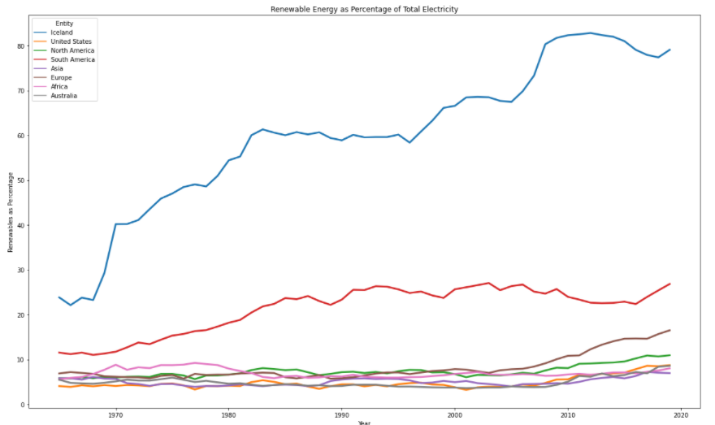
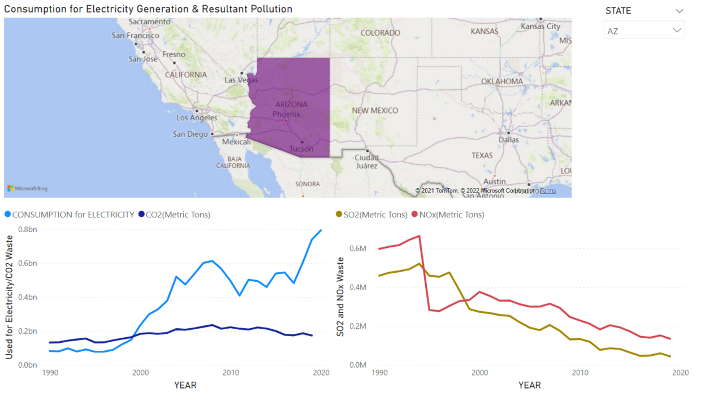

# Capstone

## What is the current state of clean energy as it applies to transportation in the United States

This project studies the progress made over the last few decades toward lowering the pollution levels created in generating electricity with the end aim as having 100% clean energy used for transportation in electric vehicles (EV’s).
Why should you care?
Pollution caused by the burning of fossil fuels has had a great effect on our environment dating back to industrialization in England in the 1800’s.  As early as 1819, a mutation occurred with the peppered moth.  In areas where trees were blackened by the burning of coal, the specked moth adapted to increased predation by animals by mutating to a black color. [Peppered Moths: Natural Selection (asu.edu)](https://askabiologist.asu.edu/peppered-moths-game/natural-selection.html)  While this mutation points to “natural selection,” the cause was pollution resulting from burning fossil fuels and it was only the start of the impact of industrialization and globalization on our environment.

## My motivation

One of the methods of attacking this change to our environment is through limiting the amount of fossil fuels being burned by driving EV’s.  While this is a laudable action, it is not as complete a solution as it seems.  Yes, the automobile is “green” but the electricity used to power the vehicle is decidedly not.  On the plus side, electricity generation is trending toward being cleaner.
Roadblocks (a few) to adoption of clean energy and transportation:  

•	Cost of EV’s   
•	Access to charging stations   
•	Cost of emerging technology to generate clean electricity   

In the United States, there are Federal, State and, in limited cases, local government incentives aimed at addressing the first roadblock.  Likewise, Federal initiatives are aimed at addressing the second and third.  My project is aimed at identifying the current state of current generation, pun intended, and exploring the infrastructure currently in place for access to charging stations.

## Methodology
### Data Acquisition
Ample data exist providing insights into my project.  Fortunately, these data exist as .csv and .xls files in governmental and NGO websites.  My data sources are listed below:

British Petroleum – dataset bp-stats-review-2021-all-data; from this site:   [Statistical Review of World Energy | Energy economics | Home (bp.com)](https://www.bp.com/en/global/corporate/energy-economics/statistical-review-of-world-energy.html)

World Resources Institute – dataset zip file global_power_plant_database_v_1_3; from this site:  [Welcome - Data | World Resources Institute (wri.org)](https://datasets.wri.org/)

U.S. Energy Information Administration (iea) – datasets listed below:   
•	annual_consumption_state   
•	cost_of_fossil_fuel   
•	emission_annual   
•	net_generation_all_sources   
•	net_generation_renewables   
•	revenue_expense_investor_owned_utilities   
•	from this site: [Homepage - U.S. Energy Information Administration (EIA)](https://www.eia.gov/)

Organisation for Economic Co-operation and Development (OECD) – dataset csv file ‘oecd.csv’; from this site: [OECD Data](https://data.oecd.org/)

Our World in Data – dataset csv file ‘renewable-share-energy.csv’; from this site:  [Our World in Data](https://ourworldindata.org/)

FRED Economic Data – dataset from csv file  ‘TOTANLSA.csv; from this site:  [Total Vehicle Sales (TOTALSA) | FRED | St. Louis Fed (stlouisfed.org)](https://fred.stlouisfed.org/series/TOTALSA)

### Cleaning
These data are extensive and, unsurprisingly, needed considerable cleaning.  Prior to any work being accomplished, most datasets required me to skip rows as I imported the csv into Python.  Further cleaning involved dropping rows from the head and tail, as well as some columns being dropped.  This all took place prior to any coding specific cleaning and sectioning. Further cleaning occurred in a two of the BP datasets where dashes (-) and insert carets (^) had to be removed/replaced.  These activities were surprisingly enjoyable.

## Analysis

### Chapter 1 – What is the current state of electricity generation?
Analysis, of course, begins with envisioning the story I wish to tell and deciding how to present such story.  My vision starts with an inductive view of electricity generation via green sources, starting with a 50+ year view of electrical generation across the world.

 

 This is followed by a view of the United States directly compared to Iceland, a country which has greatly invested in hydrothermal generation since the mid-1960’s.  

From this point, I begin to focus solely on the United States by comparing electricity generation with the three main “greenhouse gasses” generated by burning fossil fuels.  This starts with two Power BI dashboards.  The first is an interactive dashboard that allows the user to select either the nation or individual States, their consumption of fossil fuels for electricity generation, and the resultant discharge of CO2, SO2 and NOx gasses into the atmosphere. The first visual represents the United States as a whole. Note the sharp increase in consumption for electricity generation in 2011 and the significantly lower rise in the pollutants being discharged. A discussion of causality will occur later.

### Chapter 2 – Can we make progress toward green energy and reduced emissions?
The next visual shows the State of Arizona

and the third is the State of Tennessee.

Each state shows similar levels of comsumption and emissions to the national results, except CO2 in Tennessee.  This shows a significantly greater reliance on coal-fired, electricity generation.

What is surprising for Tennessee is that, generally, electricity is generated and supplied by the Tennessee Valley Authority (TVA).  The TVA was formed to meet three objectives: (1) to tame the frequent flooding and subsequent loss of life and property damage, (2) to provide reliable and predictable transportation via riverways, and (3) to provide cheap electricity to spur commerce. This made the TVA, and its use of hydroelectric, almost completely "green."  The TVA then invested heavily in nuclear power as the next efficient method of providing affordable electricity, which is also green in terms of atmospheric emissions.  Sometime in the 1970’s,however, the TVA let go of the idea of being green and invested in coal-fired generation plants.  While the fuel was relatively cheap, frequent interactions with the EPA added to the downstream costs of utilizing coal.  

At the end of the day, Each of these three visuals show a consistent decline of emissions that are harmful to the environment.  The cause of this will be shown.

 INSERT VISUAL LINK HERE   

The second Power BI dashboard contains static information including a 30-year look at fossil fuel consumption for electricity generation as well as 30 years of greenhouse gasses.  Another 20-year dataset shows the amount of coal and natural gas used to generate the electricity.  By looking at the three line charts, it become apparent that a pivotal moment occurred in 2015, when natural gas became the predominate fossil fuel for electricity generation.  CO2 shows a slow decline after the initial spike that mirrored the spike in demand for electricity.  SO2 and NOx merge in amount created and also show a slow decline.

A quick explanation of the cause of the decline in pollutants is found in this chart.  This chart represents 20 years of data relating the cost of the different fossil fuels used to generate electricity in the United States.  You will see wild variations in the cost of petroleum (heating oil) and mild variations in natural gas.  The cost of the different types of coal is steady.

Looking back at the Power BI screens, 2010 was the year when electricity generation showed a significant spike, yet pollution declined.  What you see in the Cost of Fossil Fuels chart is the reason why!

Fracking technology and practices, while controversial today, was placed in wide-spread use in the 1980’s as oil prices began to exceed the cost of domestic production.  In the early 2000’s, the US domestic oil producers saw a surprising release of natural gas from their fracking sites.  Instead of burning off the natural gas, which was the common practice, they began capturing natural gas and marketing it as an alternative to coal for energy generation.

By 2010, a "tipping point" occurred where enough generation plants had converted to natural gas to significantly affect the amount of pollution being released.  In 2010, natural gas was 2.5 to 3 times more expensive than coal.  

A fair question is “why did the generation plants change fuels when the cost of natural gas is significantly higher?”  A point of which to be aware is that this chart only shows the cost of acquiring the fuel.  The downstream costs of burning coal are also significant.  These include the “scrubbers” required to be in place and maintained that are located within the chimney stacks, as well as managing the slurry and sludge which is the byproduct of burning coal, which also contain toxic heavy metals.

As we move to 2020, the costs of all fuels, except petro costs, have compressed to nearly the same point.  It seems that we have a win with the conversion to natural gas.  It is an important improvement but we need to remember, natural gas still has a cost and it still generates greenhouse gasses.  As you can see in the bottom, right of the chart, an X marks the cost of renewables like solar, wind, etc.  There are no fuel costs and, more importantly, no pollution.

### State of Renewables in the United States

According to the EIA, the United States generated roughly 4 trillion kilowatt hours (kWH) in 2020.  Of this amount, 20% were created by renewables.  This chart

shows generation, in the United States, by renewables.  Over the past 120 years, hydroelectric has been the majority contributor to renewable energy.  Three other sources, solar thermal, bio-waste and geothermal, have been steady over time.  Interestingly, technology improvements have let to an increase for the remaining two renewables, wind and solar photovoltaic.  As you can see in the chart, wind surpassed hydroelectric in 2019 to take over as the largest source of electricity in the renewables category.  The challenge, going forward, is to continue the increase of wind and solar photovoltaic and the renewables segment as a whole.

## Chapter 3 – Are EV’s a viable alternative to fossil fuel-powered vehicles?

### Market penetration of EV’s in the United States Light-Duty Vehicle Sales

Approximately, 14 million light-duty vehicles are sold each year in the United States.  The proportion of sales of electric vehicles is tiny by comparison.  When looking at sales of EV’s only, the scale becomes easier to understand.

Plug-in Hybrids (PHEV’s) dominated the segment in the first decade of this century, while pure EV’s have taken the lead since.  While we are still looking at a total of approximately 650,000 vehicles sold in 2019 out of 14 million, this chart shows a positive trend of growth for EV’s but remains less than significant.  The barriers to entry remain.

As you recall, earlier in this document I listed these barriers:
Roadblocks (a few) to adoption of clean energy and transportation:  

•	Cost of EV’s  
•	Access to charging stations  
•	Cost of emerging technology to generate clean electricity

The cost of EV’s remains significantly higher than legacy automobiles.  However, multiple levels of government provide incentives for adopting this new technology which attenuate the cost to some degree.  Furthermore, as will be shown later, the costs to operate EV’s can be significantly less.

Likewise, the cost of emerging technologies for electricity generation are high, but the same argument exists as for the cost of EV’s.  Incentives are in place and the costs of operation are generally less.  Furthermore, as economies of scale are achieved, the technology will reduce in cost.

This leaves access to charging stations.  Human nature will always play a role in the adoption of EV’s.  Ease, or difficulty, of access to charging stations is a major sticking point.  Currently, there are more than 49,000 public charging stations in the United States. These do not include private charging location that are available to employees at the work site or home sites.

How easily accessible is the nearest charging station?  Will it charge my vehicle? How quick does it charge?  These are common questions that many will have as they contemplate purchasing an EV.

[alternative fuel sites](https://tom-hudson88.github.io/maps/)

This folium clustered map shows the locations of these public charging stations.  With the focus on Nashville, it is apparent that the number of locations is low outside of the downtown and mid-town areas.  Of the roughly 187 charging sites, 140 are in downtown and mid-town.  An additional 33 are at the airport.  This speaks a great deal to convenience but is not insurmountable if you can charge your car at home.

What does this map tell us about travelling distances in an EV?   Suppose you were taking a trip from Nashville to, for the chocolate lovers of the world, Hersey, Pennsylvania.  What is the availability of charging stations, or will I have to rent a gasoline vehicle?  Looking at the map, you can choose a route through Kentucky and Ohio at 753 miles, through Kentucky and West Virginia at 764 miles, or east through Tennessee then up through western part of Virginia at 730 miles.  This last route will be used to illustrate this trip.

Assuming a vehicle with a range of 300 miles, there are 23 charging stations in the Kingsport, Johnson City, and Bristol, TN area.  That is the first leg of approximately 300 miles.  Depending on the type of charging station, 15 minutes will get an 80% charge.  The next leg should not exceed 240 miles.  That should get you to Winchester, VA.  There are 41 charging stations in the Winchester area.  The final leg will comprise of 90 miles, leaving you with a charge of approximately 50%.  This is definitely not as convenient as gasoline, but, with proper planning, is workable.

## Summary

### Thoughts at the end of the day

I have shown the current state of electricity generation, both globally and for the United States specifically.  Secondly, I have addressed the progress the United States has made toward reducing pollution and generating clean energy.  Finally, I have demonstrated how EV’s are, not only feasible, but are suitable to both local and long-distance transportation.  I leave you with this final illustration:

